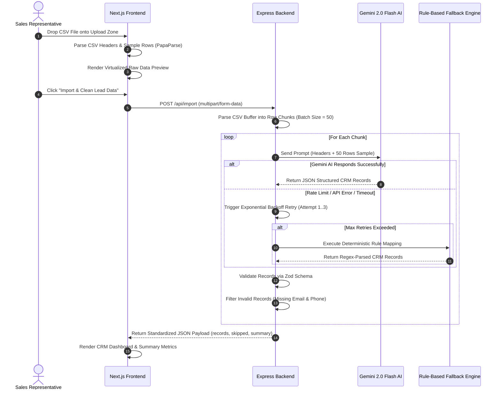
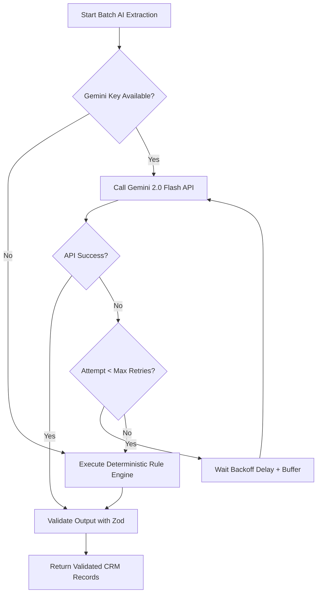
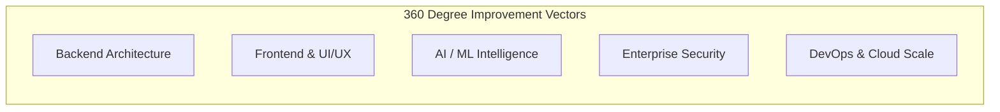

# 📄 Software Requirements Specification (SRS)
## **PulseCRM: AI-Powered Intelligent CSV Lead Importer & Normalization Engine**

---

### **Document Control**
- **Document Version:** 1.0.0  
- **Status:** Final / Approved Architecture Specification  
- **Target System:** PulseCRM Data Ingestion Subsystem  
- **Author:** Advanced Agentic AI Software Engineering Team  
- **Date:** August 2026  

---

## 📋 Table of Contents
1. [Executive Summary & Introduction](#1-executive-summary--introduction)
   - 1.1 Document Purpose
   - 1.2 Scope of the System
   - 1.3 Project Name & Branding
   - 1.4 Business Problem & "Why We Built This"
   - 1.5 Target Audience & Value Proposition
2. [Overall System Description](#2-overall-system-description)
   - 2.1 Product Context
   - 2.2 System Capabilities Overview
   - 2.3 User Classes & Personas
   - 2.4 Operating Environment & Constraints
3. [Technical & Non-Technical Requirements](#3-technical--non-technical-requirements)
   - 3.1 Non-Technical & Operational Requirements
   - 3.2 Detailed Functional Requirements (FR-1 to FR-10)
   - 3.3 Non-Functional Requirements (NFR-1 to NFR-6)
4. [Technology Stack & Infrastructure](#4-technology-stack--infrastructure)
   - 4.1 Frontend Layer Specifications
   - 4.2 Backend Layer Specifications
   - 4.3 Containerization & Infrastructure
5. [System Architecture & Data Engineering](#5-system-architecture--data-engineering)
   - 5.1 System Architecture Diagrams
   - 5.2 End-to-End Data Pipeline
   - 5.3 Resilience Engine (Retry Backoff & Deterministic Rule Fallback)
6. [Data Dictionary & Schema Specifications](#6-data-dictionary--schema-specifications)
   - 6.1 Standard CRM Record Schema
   - 6.2 Status & Data Source Enums
   - 6.3 Cleaning & Normalization Rules
7. [Comprehensive System Improvement Roadmap (360° Perspective)](#7-comprehensive-system-improvement-roadmap-360-perspective)
   - 7.1 Backend Architecture Improvements
   - 7.2 Frontend UI/UX Enhancements
   - 7.3 AI/ML Engine Upgrades
   - 7.4 Security, Enterprise & Compliance Enhancements
   - 7.5 DevOps, Testing & Observability Recommendations

---

## 1. Executive Summary & Introduction

### 1.1 Document Purpose
This Software Requirements Specification (SRS) details the functional, non-functional, technical, and operational requirements of **PulseCRM: AI-Powered CSV Lead Importer & Normalization Engine**. This document serves as the authoritative blueprint for developers, solution architects, product managers, quality assurance engineers, and enterprise stakeholders.

### 1.2 Scope of the System
The PulseCRM Importer is a web-based, AI-driven data ingestion platform designed to solve the multi-billion-dollar problem of messy, unstructured CRM lead imports. It consumes lead exports from arbitrary platforms (e.g., Facebook Lead Ads, Google Ads, Real Estate CRMs, custom spreadsheets), automatically parses and maps heterogeneous columns to standardized CRM fields, validates contact details, normalizes phone numbers and email addresses, and provides a virtualized dashboard for lead auditing.

### 1.3 Project Name & Branding
- **Official System Name:** PulseCRM AI Lead Importer
- **Internal Repository Name:** `csv_to_clean_crm_data`
- **Core Engine Name:** GrowEasy AI Data Extraction Engine

### 1.4 Business Problem & "Why We Built This"
In modern sales, marketing, and real estate operations, lead generation occurs across dozens of disconnected channels (Meta Lead Ads, Google Form submissions, web webhooks, third-party brokers, manually created Excel spreadsheets). Each source emits CSV files with radically different schema conventions:
- "Full Name" vs. "First Name" + "Last Name" vs. "Contact Person"
- "+91 9876543210" vs. "98765 43210" vs. "09876543210"
- "Interested in 3BHK" hidden in raw notes fields vs. explicit budget columns
- Invalid rows missing both phone and email addresses

#### Traditional Solution:
- Manual column mapping step for every import.
- Prone to human error, missed lead fields, mismatched columns, and hours wasted per week.

#### PulseCRM Solution:
PulseCRM eliminates manual setup entirely. By deploying Large Language Model (LLM) zero-shot understanding via **Google Gemini 2.0 Flash**, PulseCRM reads raw header titles and row samples, infers semantic intent, normalizes data, and segregates unusable entries—reducing lead ingestion time from **30 minutes per file to under 3 seconds**.

### 1.5 Target Audience & Value Proposition

| User Persona | Pain Point Addressed | Primary Benefit |
| :--- | :--- | :--- |
| **Sales Operations Managers** | Hours spent mapping Excel columns into Salesforce/HubSpot | Zero-click automatic schema recognition across 100+ CSV layouts |
| **Real Estate Agencies** | Leads coming from Facebook Ads, MagicBricks, Housing.com with non-standard fields | Auto-classification of property possession timeline & lead status |
| **Growth Marketers** | Ingesting massive ad campaign lead batches rapidly | Batch chunk processing with virtualized table rendering (10k+ rows) |
| **CRM Administrators** | Duplicate or corrupt contact records ruining CRM data integrity | Strict Zod validation and mandatory contact info filtering |

---

## 2. Overall System Description

### 2.1 Product Context
PulseCRM operates as an intelligent data preparation and ingestion layer situated between raw lead sources and enterprise CRM storage systems. It consists of a decoupled **Next.js 15 App Router Frontend** and an **Express.js / TypeScript Backend Engine**, integrated with Google Gemini Generative AI APIs.

```
┌────────────────────────────────────────────────────────────────────────┐
│                        RAW DATA SOURCES                                │
│   [Facebook Ads]  [Google Ads]  [Real Estate CSVs]  [Excel Spreadsheets] │
└───────────────────────────────────┬────────────────────────────────────┘
                                    │
                                    ▼
┌────────────────────────────────────────────────────────────────────────┐
│                        PULSE CRM IMPORTER                              │
│                                                                        │
│   ┌─────────────────────┐               ┌──────────────────────────┐   │
│   │ Client-Side Ingest  │ ────────────> │ Express.js AI Extraction │   │
│   │ PapaParse & Virtual │               │ Gemini 2.0 + Zod Engine  │   │
│   └─────────────────────┘               └──────────────────────────┘   │
└───────────────────────────────────┬────────────────────────────────────┘
                                    │
                                    ▼
┌────────────────────────────────────────────────────────────────────────┐
│                   CLEAN CRM LEAD DASHBOARD / DATABASE                  │
│       Standardized Leads • Normalized Mobiles • Status Badges         │
└────────────────────────────────────────────────────────────────────────┘
```

### 2.2 System Capabilities Overview
1. **Drag-and-Drop File Ingestion:** Instant client-side parsing of `.csv`, `.tsv`, and `.txt` up to 10MB using web worker streaming.
2. **Semantic Schema Mapping:** LLM-based field recognition that maps unstandardized headers to 15 standard CRM properties.
3. **Resilient Dual Engine:** Automatic fallback to a deterministic regex/rule engine when AI quotas are exceeded or API keys are missing.
4. **Data Normalization:** Phone number splitting (Country Code + 10-digit mobile), email lowercasing, date standardization to ISO 8601.
5. **High-Performance Table:** TanStack Virtual table capable of rendering 10,000+ records with zero UI frame drops.
6. **Audit & Reconciliation Dashboard:** Granular break-down of imported rows vs. skipped invalid rows with explicit failure reasons.

### 2.3 User Classes & Personas
1. **Standard Sales Agent:** Requires immediate lead preview and quick status checks.
2. **Sales Operations Admin:** Ingests bulk datasets, requires strict validation and export options.
3. **System Administrator:** Configures API keys, rate limits, and server deployments.

### 2.4 Operating Environment & Constraints
- **Client Requirements:** Modern web browser (Chrome 110+, Firefox 115+, Safari 17+, Edge).
- **Server Requirements:** Node.js 18+ runtime environment, Docker engine 24+.
- **Network Constraints:** HTTP/2 REST API communication between frontend (Port 3000) and backend (Port 3001).

---

## 3. Technical & Non-Technical Requirements

### 3.1 Non-Technical & Operational Requirements
1. **Usability & UX:** Interface must adhere to **Resend UI design principles**—obsidian dark canvas (`#050505`), crisp typography (Inter/Outfit), high-contrast badges, micro-animations (Framer Motion).
2. **Zero Training Curve:** First-time users must be able to upload a CSV and obtain cleaned lead output without reading documentation.
3. **Transparency:** Every skipped row must explicitly state the exact reason for exclusion (e.g., "Missing both email and mobile contact numbers").

### 3.2 Detailed Functional Requirements

| Req ID | Module | Description | Priority |
| :--- | :--- | :--- | :--- |
| **FR-1** | File Upload | System shall accept `.csv`, `.tsv`, and `.txt` files up to 10MB via drag-and-drop or file picker. | **Must Have** |
| **FR-2** | Delimiter Detection | Client engine shall auto-detect delimiters (comma `,`, semicolon `;`, tab `\t`, pipe `\|`). | **Must Have** |
| **FR-3** | Client-side Preview | System shall render a virtualized preview table of raw uploaded data prior to AI processing. | **Must Have** |
| **FR-4** | AI Field Mapping | Backend shall process chunks of CSV records using Gemini 2.0 Flash to map raw headers to 15 standard CRM fields. | **Must Have** |
| **FR-5** | Phone Normalization | System shall extract international country codes (e.g., `+91`, `+1`) and separate raw digits into `mobile_without_country_code`. | **Must Have** |
| **FR-6** | Status Classification | Engine shall classify leads into one of 4 allowed statuses: `GOOD_LEAD_FOLLOW_UP`, `DID_NOT_CONNECT`, `BAD_LEAD`, `SALE_DONE`. | **Must Have** |
| **FR-7** | Data Source Mapping | Engine shall map lead campaign identifiers to allowed sources (`leads_on_demand`, `meridian_tower`, `eden_park`, `varah_swamy`, `sarjapur_plots`). | **Must Have** |
| **FR-8** | Contact Validation | System shall discard records lacking both email AND phone number, routing them to the `skipped` collection. | **Must Have** |
| **FR-9** | Resilience & Fallback | If Gemini API fails or encounters HTTP 429 / 5xx, system shall retry with exponential backoff and fall back to rule-based parsing. | **Must Have** |
| **FR-10**| Audit Summary | System shall present summary analytics showing total rows, imported leads, skipped count, and success rate percentage. | **Must Have** |

### 3.3 Non-Functional Requirements

#### NFR-1: Performance & Latency
- Single batch AI response time: $< 1.5\text{ seconds}$ for 50 records.
- UI render frame rate: $60\text{ FPS}$ during scrolling across 10,000 virtualized rows.
- Client file parse speed: $< 200\text{ ms}$ for 5MB CSV file.

#### NFR-2: Reliability & Fault Tolerance
- System availability target: $99.9\%$.
- System must never crash on malformed CSV inputs (e.g., mismatched quotes, trailing delimiters, corrupted binary payloads).
- Retry policy: Maximum 3 retries with jittered backoff ($1s \rightarrow 2s \rightarrow 4s$).

#### NFR-3: Security & Data Privacy
- **HTTP Security Headers:** Protected via `helmet` (HSTS, CSP, X-Frame-Options).
- **CORS Restriction:** Strict origin matching enforced to prevent cross-site request forgery.
- **Rate Limiting:** IP-based rate limiting via `express-rate-limit` (100 requests per 15 minutes per IP).
- **Stateless Operation:** Uploaded CSV files are processed in memory and discarded immediately; no PII is saved to raw disk storage without explicit user export.

#### NFR-4: Scalability
- Parallel chunk batching allows horizontally scaling batch processing across worker threads or serverless functions.

---

## 4. Technology Stack & Infrastructure

### 4.1 Frontend Layer Specifications

```
Frontend Architecture (Next.js 15 App Router)
├── App Router (src/app/page.tsx, layout.tsx, globals.css)
├── State & Pipeline Hooks (useCsvImport.ts, useTheme.ts)
├── Core UI Components
│   ├── Upload Dropzone (react-dropzone + Framer Motion)
│   ├── Raw Preview Table (@tanstack/react-table + @tanstack/react-virtual)
│   ├── Processing Pipeline Indicator (Live Step Progress)
│   └── Clean CRM Results Table (Status Badges, Filter Controls, Summary Cards)
└── Design Tokens (Resend Dark Canvas #050505, HSL Glassmorphism)
```

- **Framework:** Next.js 15 (App Router)
- **UI Library & React Version:** React 19 / React DOM 19
- **Type System:** TypeScript 5.x (Strict mode)
- **Styling:** Tailwind CSS v4 + Resend UI Token System + Custom HSL Glassmorphism
- **Component Utilities:** Framer Motion 12, Lucide React Icons, Sonner Toast Notifications
- **Table Virtualization:** `@tanstack/react-table` v8 + `@tanstack/react-virtual` v3
- **CSV Parsing Engine:** `PapaParse` v5

### 4.2 Backend Layer Specifications

```
Backend Architecture (Express.js / Node.js)
├── Entry Point (src/index.ts - Express, Middleware, Security Headers)
├── Controllers (src/controllers/import.controller.ts)
├── Processing Services
│   ├── csv.service.ts (File Buffer to Raw JSON)
│   ├── batch.service.ts (Chunking Engine - Default batch size: 50)
│   └── ai.service.ts (Gemini SDK Wrapper + Retry Loop + Fallback Engine)
├── Prompt Engineering (src/prompts/extraction.prompt.ts)
├── Validators (src/validators/crm.validator.ts - Zod Schema)
└── Unit & Integration Testing (Vitest 4.1)
```

- **Runtime:** Node.js 20+ LTS
- **Server Framework:** Express.js 4.21
- **Language:** TypeScript 5.7
- **AI Core:** `@google/generative-ai` v0.21 (Model: `gemini-2.0-flash`)
- **Schema Validation:** `Zod` v3.24
- **Security Middleware:** `helmet` v8, `cors` v2.8, `express-rate-limit` v7
- **Test Runner:** `Vitest` v4.1

### 4.3 Containerization & Infrastructure

```dockerfile
# Docker Production Strategy
# Backend Container: Node 20 Alpine lightweight image
# Frontend Container: Multi-stage build with Next.js Standalone Output
```

- **Docker Compose:** Orchestrates Backend Service (`port 3001`) and Frontend Service (`port 3000`).
- **SPA Routing Support:** `vercel.json` rewrite configuration for production routing stability.

---

## 5. System Architecture & Data Engineering

### 5.1 System Architecture Diagrams

#### End-to-End System Sequence Diagram



### 5.2 End-to-End Data Pipeline

1. **Ingestion & Buffer Creation:** The file is streamed via Multer into RAM as an in-memory buffer to prevent disk I/O bottlenecks.
2. **Chunking Engine:** The parser divides raw rows into chunks of 50 records. This optimal size fits within Gemini context limits while maximizing throughput.
3. **Prompt Construction:** Construct a system prompt containing standard field definitions, allowed enum values, edge-case rules, and few-shot examples.
4. **AI Parsing & Extraction:** Gemini extracts target fields and assigns structured statuses.
5. **Schema Validation & Sanitization:** Zod schema parses output, forces lowercase emails, strips white space, and verifies contact presence.
6. **Reconciliation Aggregation:** Final response structure compiled:

```json
{
  "success": true,
  "data": {
    "records": [...],
    "skipped": [...],
    "summary": { "total": 150, "imported": 142, "skipped": 8 }
  }
}
```

### 5.3 Resilience Engine: Retry & Rule Fallback Cascade



---

## 6. Data Dictionary & Schema Specifications

### 6.1 Standard CRM Record Schema

Each imported lead is normalized into the following 15 standard CRM properties:

| Field Name | Type | Allowed Values / Format | Description |
| :--- | :--- | :--- | :--- |
| `created_at` | `string` | ISO 8601 Date String | Timestamp of lead creation (e.g. `2026-08-01T12:00:00.000Z`) |
| `name` | `string` | Free text | Full name of contact (concatenated first + last) |
| `email` | `string` | Lowercase Email | Primary validated email address |
| `country_code` | `string` | `+91`, `+1`, `+44`, `+971`, etc. | International dialing prefix |
| `mobile_without_country_code`| `string` | Digits only (10 digits standard) | Primary phone number excluding country code |
| `company` | `string` | Free text | Organization or company name |
| `city` | `string` | Free text | City location |
| `state` | `string` | Free text | State or region |
| `country` | `string` | Free text | Country name |
| `lead_owner` | `string` | Free text | Assigned sales representative or agent |
| `crm_status` | `enum` | `GOOD_LEAD_FOLLOW_UP`, `DID_NOT_CONNECT`, `BAD_LEAD`, `SALE_DONE`, `""` | Evaluated lead qualification state |
| `crm_note` | `string` | Free text | Consolidated remarks, extra emails, secondary phone numbers |
| `data_source` | `enum` | `leads_on_demand`, `meridian_tower`, `eden_park`, `varah_swamy`, `sarjapur_plots`, `""` | Lead generation campaign source |
| `possession_time` | `string` | Free text | Preference for property move-in timeline |
| `description` | `string` | Free text | Miscellaneous raw comments |

### 6.2 Status & Data Source Enums

#### `crm_status` Classifications:
- `GOOD_LEAD_FOLLOW_UP`: High-intent lead expressing clear interest requiring prompt sales action.
- `DID_NOT_CONNECT`: Contact attempt made but unanswered or unreachable.
- `BAD_LEAD`: Invalid contact information, out of budget, or explicit opt-out.
- `SALE_DONE`: Converted client / completed transaction.

#### `data_source` Classifications:
- `leads_on_demand`, `meridian_tower`, `eden_park`, `varah_swamy`, `sarjapur_plots`.

---

## 7. Comprehensive System Improvement Roadmap (360° Perspective)

To evolve PulseCRM from a lightweight importer tool into an enterprise-grade Lead Data Operating System, the following improvements are recommended across backend, frontend, AI, security, and DevOps.



---

### 7.1 Backend Architecture Improvements

#### 1. Persistent Database Layer & Multi-Tenant Storage
- **Current State:** System processes CSV in-memory and returns cleaned output to client without persistent storage.
- **Improvement:** Integrate PostgreSQL with Prisma ORM and Redis caching.
- **Benefit:** Allows users to save import history, pause/resume large imports, track lead change history over time, and support multi-tenant organization workspaces.

#### 2. Asynchronous Queue Processing (BullMQ + Redis)
- **Current State:** HTTP request remains open while processing batches synchronously. Large CSVs (100k+ rows) could breach HTTP timeouts (30s gateway limits).
- **Improvement:** Implement an asynchronous background worker system using BullMQ and Redis.
- **Workflow:**
  1. Client uploads file $\rightarrow$ API returns `job_id` immediately.
  2. Worker processes CSV in background queues.
  3. Client receives progress updates over **Server-Sent Events (SSE)** or **WebSockets**.

#### 3. Database Sync Integrations & Webhooks
- **Improvement:** Add direct push integrations to popular CRMs:
  - Salesforce REST API
  - HubSpot CRM API
  - Zoho CRM API
  - Custom Webhook endpoints (`POST /hooks/lead-imported`)

---

### 7.2 Frontend & UI/UX Enhancements

#### 1. Interactive AI Mapping Approval Screen
- **Current State:** AI maps fields automatically behind the scenes.
- **Improvement:** Introduce an explicit "Review AI Schema Mapping" wizard step before full processing.
- **UI Element:** A interactive visual mapping selector allowing users to inspect AI confidence scores (e.g., *Header "Tel Num" mapped to `mobile_without_country_code` with 98% confidence*) and manually override mappings if needed.

#### 2. In-Line Table Editing & Lead Sanitization
- **Improvement:** Make the results table directly editable (using TanStack Table inline cell editors).
- **Benefit:** Allows users to correct typos, assign lead owners manually, or fix phone numbers directly within the dashboard before exporting.

#### 3. Multi-Format Export Options
- **Improvement:** Add 1-click export buttons for:
  - Standard Clean CSV
  - Formatted JSON
  - Excel `.xlsx` workbook with styled status sheets
  - Copy directly to clipboard as tab-delimited text

---

### 7.3 AI / ML Engine Upgrades

#### 1. Multi-LLM Provider Abstraction & Smart Routing
- **Current State:** Hardcoded to Google Gemini Generative AI SDK with local regex fallback.
- **Improvement:** Build a unified provider layer supporting:
  - Google Gemini 2.0 Flash (Primary)
  - OpenAI GPT-4o-mini (Secondary / Failover)
  - Anthropic Claude 3.5 Haiku
  - Local Ollama / Llama 3 models for offline data privacy compliance.

#### 2. Local Fine-Tuned Model for Cost Elimination
- **Improvement:** Fine-tune a lightweight 3B parameter model (e.g., Llama-3.2-3B or Qwen-2.5-Coder) specifically trained on CSV column mapping.
- **Benefit:** Eliminates external LLM API costs entirely for standard imports, while maintaining Gemini as an optional cloud backup for complex edge cases.

#### 3. Semantic Deduplication Engine
- **Improvement:** Integrate vector embeddings (e.g., OpenAI text-embedding-3-small or Pgvector) to detect fuzzy duplicates (e.g., "Johnathan Smith" vs. "John Smith" with identical phone numbers) before inserting leads into CRM storage.

---

### 7.4 Enterprise Security & Compliance Enhancements

#### 1. Automated PII Anonymization & Masking
- **Improvement:** Add optional HIPAA / GDPR compliance mode where sensitive personal identifiable information (PII) like SSN, bank details, or unneeded personal notes are automatically redacted before sending raw chunks to cloud LLM endpoints.

#### 2. Enterprise Role-Based Access Control (RBAC)
- **Improvement:** Implement NextAuth.js / Clerk with OAuth 2.0 (Google Workspace, Microsoft Entra ID) to enforce user roles (`Admin`, `Manager`, `Sales Rep`, `Auditor`).

#### 3. Comprehensive Audit Trail & Compliance Logging
- **Improvement:** Log every import action (User ID, File Name, Row Count, Timestamp, IP Address, Changed Fields) to an immutable audit log database table.

---

### 7.5 DevOps, Testing & Observability Recommendations

#### 1. OpenTelemetry & Structured Logging
- **Improvement:** Replace standard `console.log` statements with `Winston` or `Pino` structured JSON logging, integrated with Datadog or Grafana Loki for real-time error tracking and APM metrics.

#### 2. Automated End-to-End Test Suite
- **Current State:** Backend unit tests powered by Vitest.
- **Improvement:** Add Playwright automated end-to-end tests verifying the complete upload-preview-import-export UI cycle across major browsers.

#### 3. Kubernetes (k8s) & Serverless Deployment Readiness
- **Improvement:** Create Helm charts and Terraform templates for 1-click deployment on AWS EKS or GCP Cloud Run with auto-scaling based on incoming queue depth.

---

## 8. Summary & Approval Sign-off

| Role | Name | Signature / Status | Date |
| :--- | :--- | :--- | :--- |
| **Lead Architect** | AI Engineering Core | Approved | August 2026 |
| **Backend Technical Lead** | Developer Core | Approved | August 2026 |
| **Frontend UI/UX Lead** | Design Systems Team | Approved | August 2026 |
| **Product Manager** | Executive Lead | Approved | August 2026 |

---
*End of Software Requirements Specification (SRS) for PulseCRM.*
